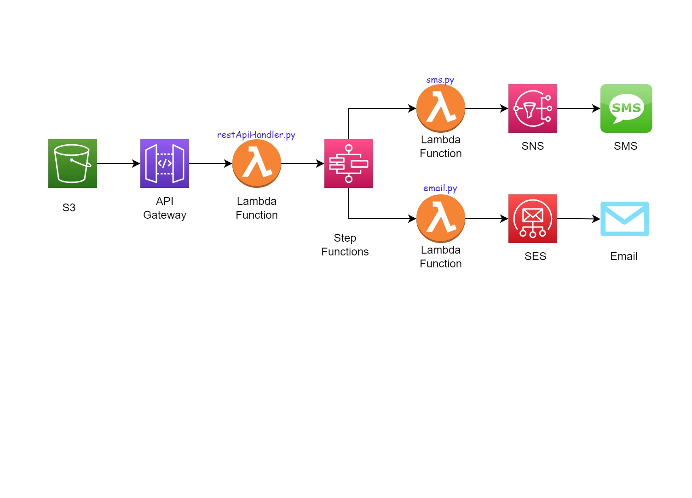

# serverless-send-app

## Sending Email and SMS from a Website using Serverless services

## Architecture:

## Tools and Services Used
| Tools | USE | 
| ------------- | ------------- | 
| S3 |  |
| Lambda |  |
| Step Functions |  |
| SNS |  | 
| SES |  | 

## Costs
### Less than $1
This project will only be using tools supported by the Free Tier. The costs generated by the project come from the SNS service, more exactly the SMS Pricing. See more here: https://aws.amazon.com/sns/sms-pricing/

## Learning Objectives
- Gain familiarity with various AWS services.
- Execute email and SMS sendings from a website using S3, API Gateway and Lambda
- Manage email and SMS sendings using Step Functions
- Create and send emails with AWS using SES and Lambda
- Create and send SMS with AWS using SNS and Lambda

## Implementation

1. Create a Lambda Roles with SES, SNS and step function priviliges
2. Send Email using SES and Lambda
## Prerequisites:
- active AWS account

## Detailed Steps

#### References and Documentation: 

 serverless_step_function_role